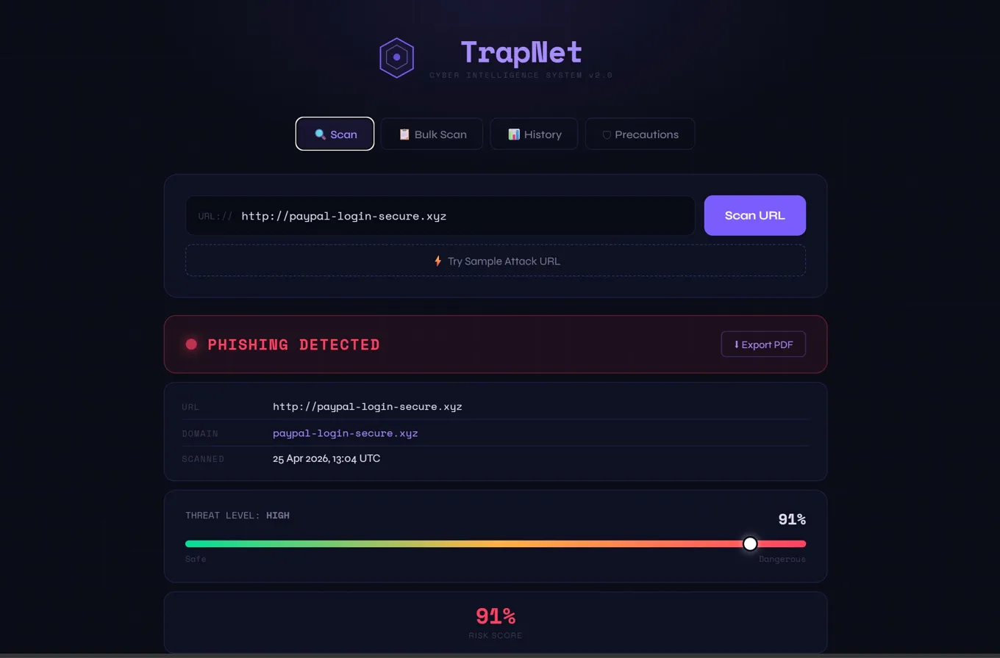
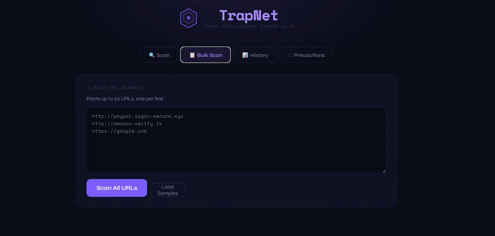
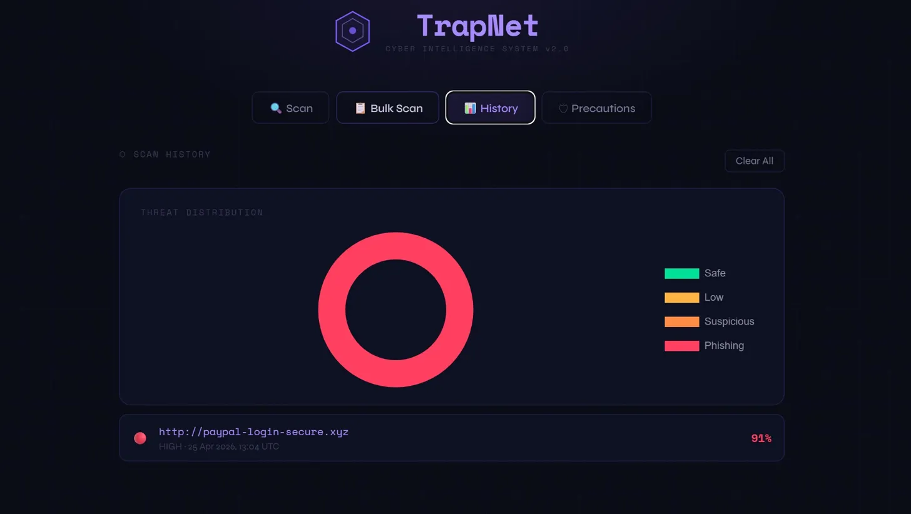
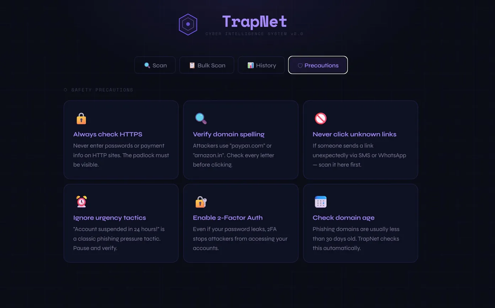

# 🕸 TrapNet — Cyber Intelligence System

> A real-time phishing & malicious URL detection system powered by Machine Learning, VirusTotal API, WHOIS intelligence, and Google Gemini AI threat analysis.


---

## 📸 Screenshots

### 🔍 Phishing Detected


### 📋 Bulk URL Scanner


### 📊 History & Threat Distribution


### 🛡 Safety Precautions


---

## ✨ Features

| Feature | Description |
|---|---|
| 🔍 **URL Scanner** | Analyzes any URL using 9+ rule-based heuristics |
| 🛡 **VirusTotal Integration** | Queries 90+ security vendors in real-time |
| 🤖 **ML Model** | TF-IDF + Logistic Regression trained on phishing dataset |
| 🧠 **Gemini AI Explanation** | Google Gemini generates plain-English threat summaries |
| 📅 **WHOIS Domain Age** | Flags domains less than 30 days old via RDAP |
| 🔒 **SSL Certificate Check** | Validates HTTPS and certificate details |
| 🌐 **IP Geolocation** | Resolves IP and checks for suspicious hosting |
| 🎯 **Typosquatting Detector** | Detects brand impersonation (paypa1, g00gle, etc.) |
| 📋 **Bulk URL Scanner** | Scan up to 20 URLs at once with summary stats |
| 📊 **Scan History + Charts** | Chart.js doughnut showing threat distribution |
| ⬇ **PDF Export** | Download full branded threat report as PDF |
| 🕐 **Animated Loading** | 7-step scan progress animation |

---

## 🗂 Project Structure

```
TrapNet/
├── app.py                    # Main Flask application
├── dataset.csv               # Phishing URL training dataset
├── requirements.txt          # Python dependencies
├── Procfile                  # For Render deployment
│
├── model/
│   ├── model.py              # ML training script
│   ├── model.pkl             # Trained model
│   └── vectorizer.pkl        # TF-IDF vectorizer
│
├── services/
│   ├── virustotal_service.py # VirusTotal API integration
│   ├── WHOIS.py              # WHOIS / RDAP domain age checker
│   ├── ssl_service.py        # SSL certificate validator
│   └── ip_service.py        # IP geolocation service
│
├── static/
│   └── style.css             # Dark cyber UI
│
└── templates/
    └── index.html            # Frontend (HTML + JS + Chart.js)
```

---

## ⚙️ Setup & Installation

### 1. Clone the repo
```bash
git clone https://github.com/kondapuresonali/TrapNet.git
cd trapnet
```

### 2. Install dependencies
```bash
pip install -r requirements.txt
```

### 3. Train the ML model
```bash
python model/model.py
```

### 4. Add API keys — create a `.env` file:
```
VT_API_KEY=your_virustotal_key_here
GEMINI_API_KEY=your_gemini_key_here
```

### 5. Run
```bash
python app.py
# Open http://localhost:5000
```

---

## 🔑 Free API Keys

### VirusTotal
1. [virustotal.com](https://virustotal.com) → Sign up → Avatar → API Key
2. Free: 4 req/min, 500/day

### Google Gemini
1. [aistudio.google.com](https://aistudio.google.com) → Sign in with Google
2. Get API Key → Create → Copy
3. Free: 1,500 req/day

---

## 🧠 Threat Scoring

```
No HTTPS              +20 pts
Raw IP in URL         +20 pts
@ symbol in URL       +20 pts
Brand impersonation   +30 pts
New domain (<30 days) +20 pts
Typosquatting         +25 pts
Suspicious keywords   +8 pts each
High-risk TLD         +15 pts
ML Model (TF-IDF)     up to +40 pts
VirusTotal vendors    up to +30 pts
──────────────────────────────────
Capped at 100
```

| Score | Level |
|---|---|
| 0–14 | ✅ Safe |
| 15–39 | 🟡 Low |
| 40–69 | 🟠 Suspicious |
| 70–100 | 🔴 Phishing |

---

## 🚀 Deploy on Render (Free)

1. Push to GitHub
2. [render.com](https://render.com) → New Web Service → Connect repo
3. Build: `pip install -r requirements.txt`
4. Start: `gunicorn app:app`
5. Environment vars: `VT_API_KEY`, `GEMINI_API_KEY`
6. Deploy → live at `https://trapnet.onrender.com`

---

## 📦 Tech Stack

| | |
|---|---|
| Backend | Python, Flask |
| ML | Scikit-learn, TF-IDF, Logistic Regression |
| Threat Intel | VirusTotal API v3, RDAP/WHOIS |
| AI | Google Gemini 1.5 Flash |
| Frontend | HTML, CSS, Vanilla JS, Chart.js |
| PDF | ReportLab |
| Deploy | Render |

---

## 🔮 Roadmap
- [ ] Chrome Extension
- [ ] Email phishing analyzer
- [ ] Dark/Light mode toggle
- [ ] Shareable scan links
- [ ] Telegram/Discord webhook alerts

---

## 👨‍💻 Author

Built with 🔥 by **SONALI**


[](https://github.com/kondapuresonali)
[](https://linkedin.com/in/sonali-kondapure)

---

> ⭐ Star this repo if TrapNet helped you!
